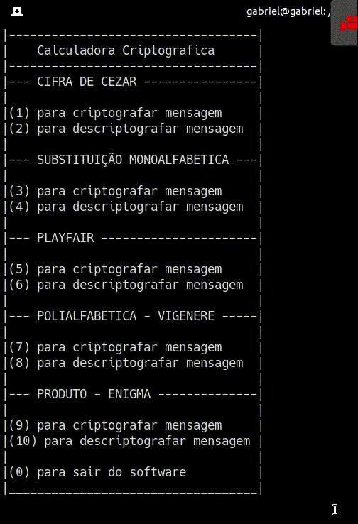

<h1 align="center">
  
</h1>

<p align="center">
  
  
  
  <a href="https://github.com/gabrielvieira1/CalculadoraDeCriptografia/blob/master/LICENSE" target="_blank">
    
  </a>
  
  <a href="https://www.linkedin.com/in/bielvieira/" target="_blank">
    
  </a>
  
  <a href="https://twitter.com/bielvieir4" target="_blank">
   
  </a>
</p>

<p align="center">
  <a href="#-about-the-project">About the project</a>&nbsp;&nbsp;&nbsp;|&nbsp;&nbsp;&nbsp;
  <a href="#-technologies">Technologies</a>&nbsp;&nbsp;&nbsp;|&nbsp;&nbsp;&nbsp;
  <a href="#-operation">Operation</a>&nbsp;&nbsp;&nbsp;|&nbsp;&nbsp;&nbsp;
  <a href="#-layout">Layout</a>&nbsp;&nbsp;&nbsp;|&nbsp;&nbsp;&nbsp;
  <a href="#-prerequisites">Prerequisites</a>&nbsp;&nbsp;&nbsp;|&nbsp;&nbsp;&nbsp;
  <a href="#-how-to-contribute">How to contribute</a>&nbsp;&nbsp;&nbsp;|&nbsp;&nbsp;&nbsp;
  <a href="#memo-license">License</a>
</p>


## 💻 About the project

<strong>CalcCripto</strong> CalcCripto is a project developed for the discipline of Cryptographic Methods based on the Cesar Cipher, Playfair, Vigenére and Enigma.

## 🚀 Technologies

- Cifra de César
- Substituição Monoalfabética 
- Cifra de Playfair
- Cifra de Vigenère
- Produto - Enigma

## 🛠 Operation

Ao iniciar o sistema, vai pedir para digitar uma das opcões listadas abaixo 
<blockquote>
1 para criptografar com a CIFRA DE CÉSAR<br>                             
2 para descriptografar com a CIFRA DE CÉSAR<br>                             
3 para criptografar com a SUBSTITUIÇÃO MONOALFABÉTICA <br>
4 para descriptografar com a SUBSTITUIÇÃO MONOALFABÉTICA <br>
5 para criptografar com a CIFRA PLAYFAIR<br>  
6 para descriptografar com a CIFRA PLAYFAIR<br>  
7 para criptografar com a POLIALFABÉTICA - VIGENÈRE  <br> 
8 para descriptografar com a POLIALFABÉTICA - VIGENÈRE  <br> 
9 para criptografar com a PRODUTO - ENIGMA<br>   
10 para descriptografar com a PRODUTO - ENIGMA<br>   
0 para sair do software  <br>
</blockquote>          
<br>
Selecionando por exemplo CIFRA DE CÉSAR, opção 1, temos a seguinte resposta:
<br>

<blockquote>Informe a mensagem que deseja cifrar </blockquote>

é pedido para informar a mensagem que seja cifrar, o sistema aceita espaços, mas vai removelos, vamos usar por exemplo o nome: gabriel

Clicando enter com a mensagem já digitada, é pedido a chave de deslocamento, como mostra a resposta abaixo: 

<blockquote> Informe a chave </blockquote>

Vamos colocar por exemplo como resposta para o sistema o número 2 e temos a seguinte resposta: 
<blockquote> Resultado da cifragem: icdtkgn </blockquote>
<br>
Esperando por mais 3 segundo, o sistema volta para o menu principal perguntando se deseja fazer mais alguma coisa ou digitar 0 para finalizar.

## 🔖 Layout

<h1 align="center">
    
</h1>

## 🔥 Prerequisites

```bash
# Clone this repository
$ git clone https://github.com/gabrielvieira1/CalculadoraDeCriptografia.git

Java - Oracle Java (JDK - Java Development Kit)

or

Java - OpenJDK
```

## 🤔 How to contribute

- Make a fork;
- Create a branck with your feature: `git checkout -b my-feature`;
- Commit changes: `git commit -m 'feat: My new feature'`;
- Make a push to your branch: `git push origin my-feature`.

After merging your receipt request to done, you can delete a branch from yours.

## :memo: License

This project is under the MIT license. See the [LICENSE](LICENSE) for details.


Made with ♥ by Gabriel Vieira :wave: [Get in touch!](https://www.linkedin.com/in/bielvieira/)
